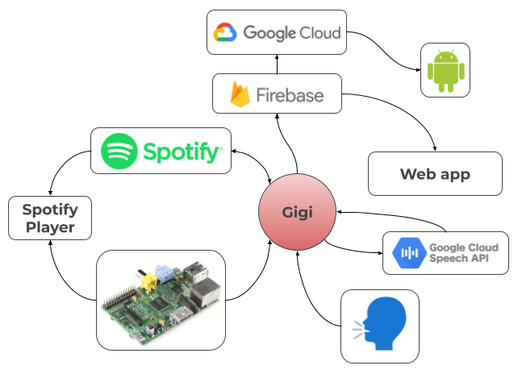

# Gigi Assistant
Add your ```.env``` containing the Spotify Client secret and ID, and the firebase credentials.

Run ```main.py```

Enjoy!

[Web app](https://andrei-lazarov.github.io/web-iiotca/)

[Web app repo](https://github.com/andrei-lazarov/web-iiotca)


